# PDF2Podcast

This project uses [Kokoro](https://huggingface.co/hexgrad/Kokoro-82M) – a lightweight, open-weight TTS model with 82 million parameters – to create a Google NotebookLM style Text-to-Speech application with a user-friendly Gradio interface.

Reason for using Kokoro:- It's the best open-source non-proprietary model in [TTS-Arena](https://huggingface.co/spaces/TTS-AGI/TTS-Arena)

🚀 **Try it out:** [Live Demo on Hugging Face Spaces](https://huggingface.co/spaces/udayl/NotebookLM-Kokoro_TTS_App)

## Sample audio (Kokoro)

https://github.com/user-attachments/assets/6ba7338b-9e63-42ed-88e3-e5890ebb949c

## Sample audio (Kyutai)

https://github.com/user-attachments/assets/029b0090-cb9c-4281-829f-4d0a8257efe2

## Architecture diagram

```mermaid
graph TD
    A[👤 User] --> B[🌐 Web Browser]
    B --> C[📱 Gradio UI]
    C --> D[🐍 Server]

    subgraph docker[🐳 Docker Container]
        D --> E[📄 PDF Processor]
        E --> G[📝 Transcript Generator]
        G --> F[🤗 Kokoro TTS]
    end

    F --> H[🔊 Audio Output]
    D --> H
    H --> B
    G <--> I[🤖 OpenAI/OpenRouter]

    classDef default fill:#0d1117,stroke:#30363d
    classDef container fill:#161b22,stroke:#30363d
    classDef output fill:#238636,stroke:#2ea043
    classDef api fill:#1f6feb,stroke:#388bfd

    class docker container
    class H output
    class I api
```



## Features

- **PDF to Audio Conversion:** Upload any PDF document and convert it into engaging conversations
- **Multiple Voice Options:** Choose from different voices for each speaker
- **API Flexibility:** Support for OpenAI, OpenRouter, and **Kyutai TTS (Moshi)**
- **Parallel Processing:** Utilizes all CPU cores for faster audio generation
- **User-Friendly Interface:** Easy-to-use Gradio web interface
- **Cross-Platform:** Works on Windows, Linux, and macOS

## Setup Instructions

### 1. System Dependencies

**macOS:**
```bash
brew install espeak-ng
```

**Linux (Ubuntu/Debian):**
```bash
sudo apt-get update
sudo apt-get install espeak-ng
```

**Windows:**
1. Download espeak-ng from [GitHub releases](https://github.com/espeak-ng/espeak-ng/releases)
2. Run the installer and add it to your system PATH

### 2. Python Environment Setup

This project uses Python 3.9+ and can be set up using either uv or pip:

#### Using uv (Recommended)
```bash
# Install uv
pip install uv

# Create and activate virtual environment
uv venv
source .venv/bin/activate  # On Windows: .venv\Scripts\activate
```

#### Using pip
```bash
# Create and activate virtual environment
python -m venv .venv
source .venv/bin/activate  # On Windows: .venv\Scripts\activate
```

### 3. Install Dependencies

```bash
uv sync
```
[More about UV](https://docs.astral.sh/uv/guides/projects/#__tabbed_1_1)

Or install individually:
```bash
pip install "kokoro>=0.9.2" soundfile torch gradio PyPDF2 numpy openai ipython
```

## Using Kyutai TTS (Moshi)

- Select **Kyutai** as the API provider in the Gradio interface.
- No API key is required for Kyutai/Moshi (runs locally).
- You can specify voice files from [DSM TTS Voices](https://huggingface.co/expresso/DSM-TTS-Voices).


## Running the Application

1. **Start the Gradio Interface:**
```bash
python gradio_app.py
```

2. **Access the Interface:**
- Open your browser and go to: `http://127.0.0.1:7860`
- Or use the provided public URL for temporary access

3. **Using the Interface:**
- Upload a PDF document
- Choose voices for Speaker 1 and Speaker 2
- Select your preferred API provider (OpenAI/OpenRouter)
- Enter your API key
- Click "Generate Audio" to create the conversation

## API Configuration

### OpenAI
- Sign up at [OpenAI](https://platform.openai.com)
- Get your API key from the dashboard
- Use `https://api.openai.com/v1` as the API base URL

### OpenRouter
- Sign up at [OpenRouter](https://openrouter.ai)
- Get your API key from the dashboard
- Use default base URL or your custom endpoint

## Performance Notes

- Audio generation is parallelized across CPU cores for optimal performance
- Processing time depends on:
  - PDF length
  - Available CPU cores
  - System memory
  - Network speed for API calls

## Troubleshooting

- **Audio Not Generating:** Ensure espeak-ng is properly installed and accessible
- **API Errors:** Verify your API key and base URL
- **PDF Issues:** Ensure the PDF contains readable text (not scanned images)
- **Memory Issues:** For large PDFs, ensure sufficient system memory is available

## Alternatives
- [podcastify](https://github.com/souzatharsis/podcastfy?tab=readme-ov-file)
- [LocalNotebook LM](https://github.com/Goekdeniz-Guelmez/Local-NotebookLM)

## Contributing

Feel free to open issues or submit pull requests for improvements!

## License

This project is open-source and available under the MIT License.
