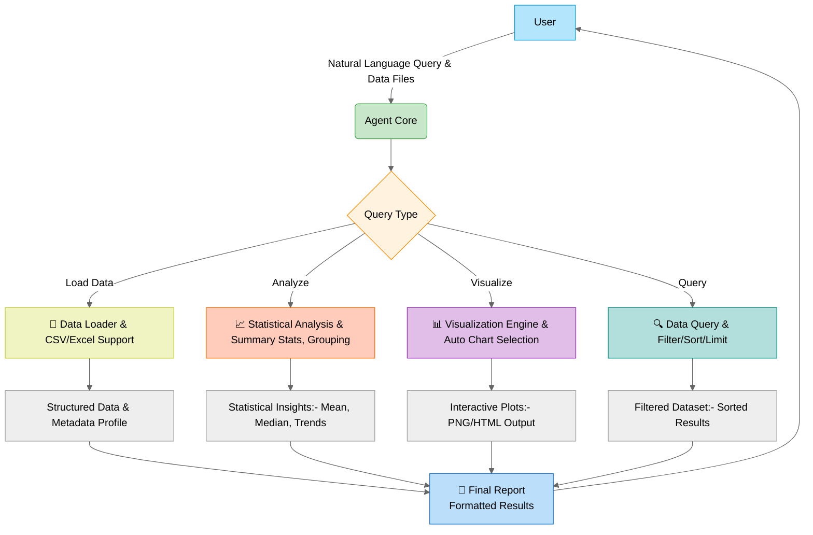

# Agentic Data Analysis Framework

## Overview
A conversational AI agent for automated data analysis with natural language queries. Key capabilities:
- 📊 Smart visualization selection (histograms, scatter plots, bar/line charts)
- 🔍 Automated data profiling and statistical analysis
- 🧩 Modular tool architecture (data loading, analysis, visualization, querying)
- 🤖 Gemini-2.0-flack model integration (via Google ADK)

### 🚀 **Why Choose Google ADK? (First-Time User Perspective)**  

1. **Built-In Production Tooling (Zero Setup)**  
   - **ADK Advantage**: Integrated evaluation CLI, session debugging UI, and one-click deployment to Vertex AI Agent Engine—ideal for beginners avoiding infra complexity .  
   - **vs. Alternatives**:  
     - LangGraph/CrewAI: Require manual LangSmith/BentoML setup for monitoring/deployment .  
     - Autogen: No native deployment options; DIY Docker/cloud config needed .  

2. **Structured Workflows > Open-Ended Complexity**  
   - **ADK Advantage**: Prebuilt `SequentialAgent`, `ParallelAgent`, and `LoopAgent` simplify complex pipelines (e.g., KYC document processing) without graph theory knowledge .  
   - **vs. LangGraph**: Forces low-level state-graph/node/edge design—steeper learning curve .  
   - **vs. CrewAI**: Role-based agents lack deterministic orchestration .  

3. **Enterprise-Grade Security & Interop**  
   - **ADK Advantage**:  
     - **A2A Protocol**: Securely connect agents across vendors (e.g., SAP ↔️ Box AI) .  
     - **MCP Tools**: Standardized API/database connectors (e.g., BigQuery, YouTube Search) .  
   - **CrewAI/LangGraph**: Custom security/auth required; no cross-platform agent interop .  

4. **RAG Grounding + State Management**  
   - **ADK Advantage**:  
     - **Built-in RAG**: `search_all_corpora_tool` and Vertex AI grounding reduce hallucinations .  
     - **Session/State**: Automatic context persistence across interactions (`Events`, `State`, `Memory`) .  
   - **LangGraph**: Manual state stitching; RAG requires LlamaIndex/LangChain add-ons .  

5. **Google Ecosystem Acceleration**  
   - **ADK Advantage**: Gemini model optimizations, BigQuery/Vertex AI integrations, and Search Grounding for real-time data accuracy .  
   - **Others**: CrewAI/Autogen lack native GCP tooling; LangChain needs custom Gemini adapters .  

---

### ⚖️ **Framework Comparison Summary**  
| **Capability**          | **Google ADK**                       | **LangGraph**                 | **CrewAI**               |  
|--------------------------|--------------------------------------|--------------------------------|--------------------------|  
| **Deployment**           | Vertex AI Agent Engine (managed)     | DIY (LangSmith + Cloud Run)    | Limited (e.g., Flask)    |  
| **Security**             | ✅ A2A Protocol + MCP auth          | ❌ Custom implementation       | ❌ Minimal built-in      |  
| **RAG Integration**      | ✅ Native (Vertex AI)               | ❌ Requires plugins            | ❌ Manual setup          |  
| **Workflow Patterns**    | Sequential/Parallel/Loop agents      | Custom graphs (code-heavy)     | Role-based agents only  |  
| **Beginner Friendliness**| ✅ Low-code, declarative agents     | ❌ Steep learning curve        | ✅ Moderate             |  

💎 **Key Takeaway**: ADK shines for **production-ready, secure multi-agent systems** needing RAG grounding, GCP integration, and minimal setup—ideal for beginners prioritizing structure over maximal flexibility .  

> 🔍 **When to Choose Alternatives**:  
> - Pick **LangGraph** for granular control of complex state machines .  
> - Use **CrewAI** for simple role-based chatbots without deployment needs .  
> - Opt for **Autogen** for research-focused agent collaboration .

## Architecture




## Features
### Core Components
- `load_data_tool`: Intelligent data ingestion (CSV/Excel) with automatic type detection
- `analyze_data_tool`: NLP-driven statistical analysis (summary stats, group-by ops)
- `visualize_data_tool`: Context-aware visualization engine (Plotly-based)
- `query_data_tool`: Natural language data filtering/sorting

### Advanced Capabilities
- Automatic chart type selection based on data types
- Dynamic column matching from natural language queries
- Image generation with timestamped report archiving
- Base64 encoded visualizations for web integration

## Installation
```bash
# Install dependencies
python -m venv venv
source venv/bin/activate
pip install -r requirements.txt

# Configure environment
cp .env.example .env  # Add your Google API key
```

## Usage Example
```python
adk web --reload
```

## Resources
- [Google ADK Data science Example](https://github.com/google/adk-samples/tree/main/python/agents/data-science/data_science)
- [Google ADK library and docs](https://github.com/google/adk-python?tab=readme-ov-file)