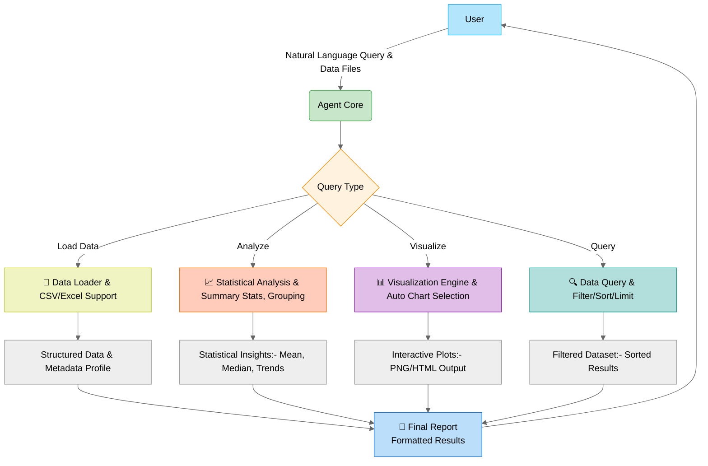

# Agentic Data Analysis Framework

## Overview
A conversational AI agent for automated data analysis with natural language queries. Key capabilities:
- 📊 Smart visualization selection (histograms, scatter plots, bar/line charts)
- 🔍 Automated data profiling and statistical analysis
- 🧩 Modular tool architecture (data loading, analysis, visualization, querying)
- 🤖 Gemini-2.0-flack model integration (via Google ADK)

## Architecture




## Features
### Core Components
- `load_data_tool`: Intelligent data ingestion (CSV/Excel) with automatic type detection
- `analyze_data_tool`: NLP-driven statistical analysis (summary stats, group-by ops)
- `visualize_data_tool`: Context-aware visualization engine (Plotly-based)
- `query_data_tool`: Natural language data filtering/sorting

### Advanced Capabilities
- Automatic chart type selection based on data types
- Dynamic column matching from natural language queries
- Image generation with timestamped report archiving
- Base64 encoded visualizations for web integration

## Installation
```bash
# Install dependencies
python -m venv venv
source venv/bin/activate
pip install -r requirements.txt

# Configure environment
cp .env.example .env  # Add your Google API key
```

## Usage Example
```python
adk web --reload
```
