# Agentic Data Analysis Framework

## Overview

Agentic Data Analysis is a conversational AI framework built for automated data analysis using natural language queries. Key capabilities include:

- 📊 **Smart Visualization Selection**: Histograms, scatter plots, bar/line charts, and more.
- 🔍 **Automated Profiling**: Data profiling and detailed statistical analysis.
- 🧩 **Modular Tool Architecture**: Seamlessly integrates data ingestion, analysis, visualization, and querying.
- 🤖 **Integrated Gemini Model**: Powered by the gemini-2.5-flash model via Google ADK.

> **Note**: Custom Gemini adapters are required for full integration.

---

## Demo

https://github.com/user-attachments/assets/de688367-8a42-4a8e-ad4a-a7364ef9f807

## Why Choose Google ADK?

1. **Built-In Production Tooling (Zero Setup)**
   - **Advantage**: ADK comes with an integrated evaluation CLI, session debugging UI, and one-click deployment to Vertex AI Agent Engine—ideal for beginners who want to avoid infrastructure hassles.
   - **In Comparison**:
     - **LangGraph/CrewAI**: Require manual setup (e.g., LangSmith, BentoML) for monitoring and deployment.
     - **Autogen**: Lacks native deployment options and needs DIY container or cloud configuration.

2. **Structured Workflows Over Open-Ended Complexity**
   - **Advantage**: With prebuilt agents like `SequentialAgent`, `ParallelAgent`, and `LoopAgent`, ADK simplifies complex pipelines (e.g., KYC document processing) without the need for deep graph theory knowledge.
   - **In Comparison**:
     - **LangGraph**: Must design low-level state graphs manually.
     - **CrewAI**: Offers role-based agents with limited deterministic orchestration.

3. **Enterprise-Grade Security & Interoperability**
   - **Advantage**: ADK employs the A2A Protocol for secure multi-vendor connectivity and MCP tools for standardized API/database connectors (e.g., BigQuery, YouTube Search).
   - **In Comparison**:
     - **CrewAI/LangGraph**: Often require custom security implementations and lack cross-platform interoperability.

4. **RAG Grounding & State Management**
   - **Advantage**: With built-in RAG capabilities (e.g., `search_all_corpora_tool`) and automatic session/context persistence, ADK reduces hallucinations and streamlines state management.
   - **In Comparison**:
     - **LangGraph**: Requires manual state stitching.
     - **Other Solutions**: Often need LangChain or LlamaIndex add-ons for RAG support.

5. **Accelerated Google Ecosystem Integration**
   - **Advantage**: Optimized for Gemini model performance along with tight integrations on Vertex AI, BigQuery, and search grounding for real-time data accuracy.
   - **In Comparison**:
     - **CrewAI/Autogen**: Lack native GCP tooling, while LangChain users must build custom Gemini adapters.

---

## Framework Comparison Summary

| **Capability**          | **Google ADK**                       | **LangGraph**                 | **CrewAI**               |
|-------------------------|--------------------------------------|-------------------------------|--------------------------|
| **Deployment**          | Vertex AI Agent Engine (managed)     | DIY (LangSmith + Cloud Run)    | Limited (e.g., Flask)    |
| **Security**            | ✅ A2A Protocol + MCP auth           | ❌ Custom implementation      | ❌ Minimal built-in      |
| **RAG Integration**     | ✅ Native (Vertex AI)                | ❌ Requires plugins            | ❌ Manual setup          |
| **Workflow Patterns**   | Sequential/Parallel/Loop agents      | Custom graphs (code-heavy)    | Role-based agents only  |
| **Beginner Friendliness** | ✅ Low-code, declarative agents     | ❌ Steep learning curve       | ✅ Moderate             |

> **Key Takeaway**: ADK excels for people seeking production-ready, secure multi-agent systems with RAG grounding, deep GCP integration, and minimal setup—all while offering a gentle learning curve.

> **When to Choose Alternatives**:
> - **LangGraph**: If granular control over complex state machines is required.
> - **CrewAI**: For simple role-based chatbots without extensive deployment needs.
> - **Autogen**: When research-focused agent collaboration is desired.

---

## Architecture

Below is the system architecture diagram in Mermaid syntax. Paste this directly into your GitHub README to visualize the framework:

```mermaid
flowchart TD
    A["📄 CSV File"] --> B["🧩 Data Loader"]
    B --> C["📊 DataFrame"]
    C --> D["🛠️ Preload Tool"]
    D --> E["🤖 Agent"]
    E --> F["💻 SQL Tool"]
    F --> G["🚀 Runner"]
    G --> H["🗃️ Artifact Service"]
    G --> I["🗄️ Session Service"]
```



---

## Features

### Core Components

- **Data Ingestion (`load_data_tool`)**: Intelligent ingestion for CSV/Excel files with type detection.
- **Data Analysis (`analyze_data_tool`)**: Natural language-driven statistical summaries, group-by operations, and profiling.
- **Visualization (`visualize_data_tool`)**: Context-aware chart selection using Plotly-based visualizations.
- **Querying (`query_data_tool`)**: Natural language filters, sorts, and SQL query generation over the preloaded data.

### Advanced Capabilities

- Automatic chart type suggestion based on data profiles.
- Dynamic column matching for translating plain language queries into executable SQL.
- Image generation with timestamped report archiving.
- Base64 encoded visualization outputs for seamless web integration.

---

## Installation

Follow these steps to set up the framework:

```bash
# Create and activate a virtual environment
python -m venv venv
source venv/bin/activate

# Install the project dependencies
pip install -r requirements.txt

# Configure your environment
cp .env.example .env  # Update with your Google API key and any other required settings
```

**Note:** In `root_agent.py`, the path to the CSV file is hardcoded due to issues with data loading in Google ADK. The setting is data agnostic, so feel free to change it if needed.


---

## Usage Example

Start the web interface (with autodiscovery for file changes):

```bash
# Please run this command outside the project folder to ensure proper detection of the project structure
adk web --reload
```

---

## Todo / Future Enhancements

Consider the following as part of your improvement roadmap:

- **Integrate Langfuse for Observability**
  - Add logging and tracing around tool invocations and agent decisions.
  - Instrument key functions (SQL execution, data loading) to capture performance metrics.
  - Leverage ADK’s observability hooks/callbacks for seamless integration.

- **Incorporate Evals for Agent Testing**
  - Use the evals framework to compare generated SQL queries with expected outputs.
  - Automate test cases for edge conditions (e.g., malformed queries, missing data).
  - Integrate eval reports into the CI/CD pipeline for continuous monitoring of model performance.

- **Enhance MLOps Capabilities**
  - Implement automated deployment with Cloud Run or GKE (as recommended in ADK docs).
  - Track session and artifact data for versioning and reproducibility.
  - Set up robust monitoring and alerting for production performance and errors.

- **Additional Improvements from ADK Docs**
  - **Advanced Workflows**: Explore multi-agent systems or workflow agents (sequential, parallel, loop) to handle more complex data tasks.
  - **Callback Patterns**: Integrate custom callbacks for better asynchronous handling and error management.
  - **Security & Safety**: Enhance safety checks to ensure robust and secure SQL query handling.

---

## Presentattions

- slidesgpt - https://slidesgpt.com/l/pzKi
- Gamma - agentic_data_analysis/Automated-Data-Analysis-Framework)gamma.pptx
- app.presentations.ai - agentic_data_analysis/Automated Data Analysis Framework.pdf


## Resources

- [Google ADK Data Science Example](https://github.com/google/adk-samples/tree/main/python/agents/data-science/data_science)
- [Google ADK Library and Documentation](https://github.com/google/adk-python?tab=readme-ov-file)
